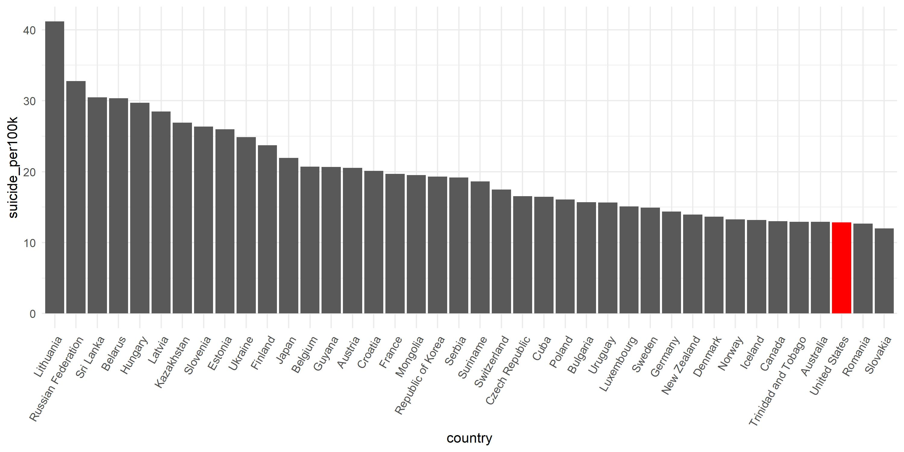

 
 
 
 

According to WHO, about 800,000 people died by suicide in 2016, of which 79% occurred in low- and middle-income countries. Overall, suicide accounts for 1.4% of all deaths worldwide, and has become the second leading cause of death among 15-29 age group. 
 
 

# World Suicide Change map

<i><b>Findings</b></i>
<ul>
<li>In the time period, most countries's suicide rates didn't have dramatic change. </li>
<li>In Russia, an obvious change in suicide rate can be observed. From 1990 to 1999, an increase was shown, as the color got lighter. From 2010-2016, there was a noticable decrease, with heavier color showing up.</li>
<li>The suicide rate in Sourth American stayed in low position during 1985-2016</li>
</ul>

 
 

# World Total Suicide Change

<i><b>Findings</b></i>
<ul>
<li>From 1985-1995, the suicide rate soared dramatically, inceasing by more 3 per 100k people </li>
<li>The peak was in 1995, 15.3 per 100k people</li>
<li>After 1995, an obvious and persistent decrease happened, with occasional rise in this period</li>

</ul>
 
 

# World Total Suicide Change by Gender

<i><b>Findings</b></i>
<ul>
<li>In males, the suicide rate fluctuated a lot. From 1985-1995, the rate increased largely and peacked around 25 death per 100k at 1995. After 1996, a steady decrease ocurred.</li>
<li>In female, a very slight decrease was observed during the time</li>
<li>The rate in male was about 3 times higher than rate in female </li>
</ul>

 
 

# World Total Suicide Change by Age

<i><b>Findings</b></i>
<ul>
<li>Trend in 15-74 years were largely consistant. </li>
<li>In 75+ age group, the decrease happened all the time, from 30 death per 100k to 21 death per 100k.  </li>
<li>Generally, the 75+ group had highest suicide rate, while 5-14 gae group had lowest rate all the time. </li>
</ul>

# Average Suicide Rate Ranking by Country
 
 

The bar chart shows  top 40 countries with high average suicida rate from 2010-2016

<i><b>Findings</b></i>
<ul>
<li>The country with highest suiciate rate is Lithuania, with more than 30 death per 100 k people </li>
<li>America ranks around 23th, with around 15 death per 100k people, inciding a not optimistic situation  </li>

</ul>