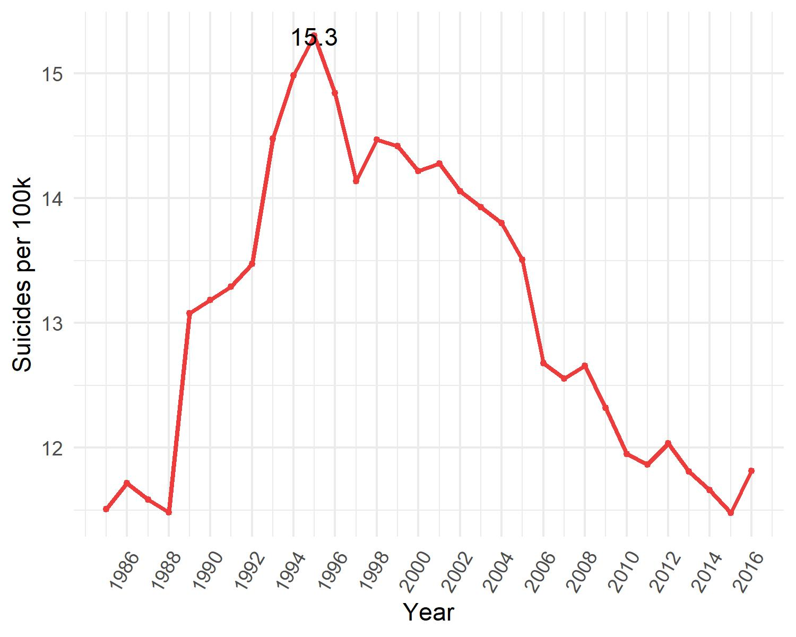
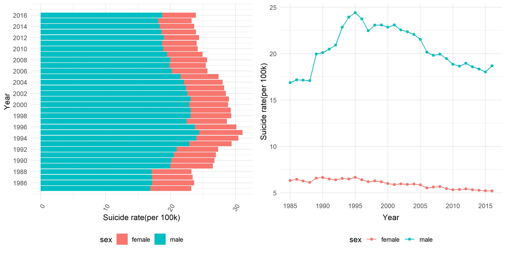

<br>
</br>
<br>
</br>

According to WHO, about 800,000 people died by suicide in 2016, of which 79% occurred in low- and middle-income countries. Overall, suicide accounts for 1.4% of all deaths worldwide, and has become the second leading cause of death among 15-29 age group. 
<br>
</br>

# World Suicide Change map


<i><b>Findings</b></i>
<ul>
<li>In the time period, most countries' suicide rates didn't have dramatic changes. </li>
<li>In Russia, an obvious change in the suicide rate can be observed. From 1990 to 1999, an increase was shown, as the color got lighter. From 2010-2016, there was a noticeable decrease, with heavier color showing up.</li>
<li>The suicide rate in South American stayed in low position during 1985-2016</li>
</ul>

<br>
</br>

# World Total Suicide Change
<center>

</center>

<i><b>Findings</b></i>
<ul>
<li>From 1985-1995, the suicide rate soared dramatically, increasing by more 3 deaths per 100k population </li>
<li>The peak was in 1995, 15.3 deaths per 100k people</li>
<li>After 1995, an obvious and persistent decrease happened, with occasional rises in this period</li>

</ul>
<br>
</br>

# World Total Suicide Change by Gender
<center>

</center>

<i><b>Findings</b></i>
<ul>
<li>In males, the suicide rate fluctuated a lot. From 1985-1995, the rate increased largely and peaked around 25 deaths per 100k in 1995. After 1996, a steady decrease occurred.</li>
<li>In female, a very slight decrease was observed during the time</li>
<li>The rate in male was about 3 times higher the than rate in female </li>
</ul>

<br>
</br>

# World Total Suicide Change by Age
<center>

</center>
<i><b>Findings</b></i>
<ul>
<li>Trends in 15-74 years were largely consistent. </li>
<li>In the 75+ age group, the decrease happened all the time, from 30 death per 100k to 21 death per 100k.  </li>
<li>Generally, the 75+ group had the highest suicide rate, while 5-14 age group had the lowest rate all the time. </li>
</ul>

# Average Suicide Rate Ranking by Country
<br>
</br>

```{r, echo = FALSE,message=FALSE,warning=FALSE}
library(tidyverse)
library(plotly)
global=read_csv("./data/master.csv")
global_rank=global %>%
  filter(year>2010) %>% 
  group_by(country) %>% 
  summarize(suicide_per100k = (sum(as.numeric(suicides_no)) / sum(as.numeric(population))) * 100000) %>% 
  arrange(desc(suicide_per100k)) %>% 
  ungroup() %>% 
  mutate(
    country=as.factor(country),
    country=fct_reorder(country,desc(suicide_per100k))
  ) %>% 
  head(40) %>% 
  mutate(highlight_flag = ifelse(country == 'United States', T, F))
  


d=ggplot(global_rank,aes(x=country,y=suicide_per100k))+geom_bar(aes(fill = highlight_flag),stat="identity")+theme(legend.position = "none",axis.text.x = element_text(angle = 60, hjust = 1))+
  scale_fill_manual(values = c('#595959', 'red'))

ggplotly(d)
```


The bar chart shows the top 40 countries with high average suicide rate from 2010-2016
<br>
</br>
<i><b>Findings</b></i>
<ul>
<li>The country with the highest suicide rate is Lithuania, with more than 30 deaths per 100k population </li>
<li>U.S. ranks around 23th, with around 15 deaths per 100k population, incicating a not optimistic situation  </li>

</ul>