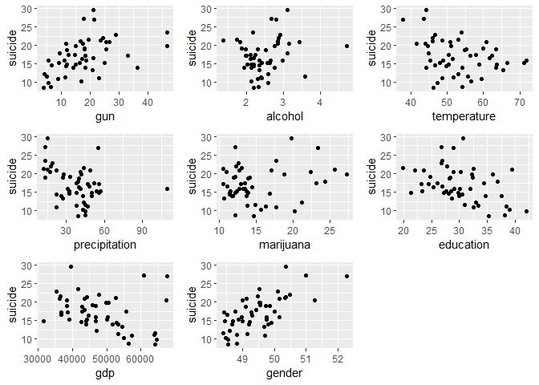
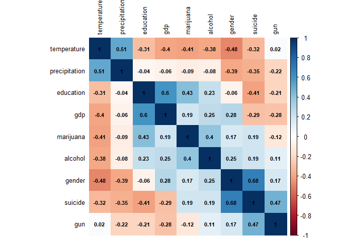

Regression
================

## Method

Data from several sources were joined together into a merged dataset. We
used 2017 year to build the model. Main outcome is suicide rate for each
state, candidate predictors are gun, alchohol, temperature,
precipitation, marijuana, education, gdp, gender for each
state.

|   Predictor   |                       Description                        |
| :-----------: | :------------------------------------------------------: |
|    suicide    |            Suicide rate per 100000 population            |
|      gun      |            Number of guns per 1000 population            |
|    alcohol    |   Alcohol consumption per capita (gallons of ethanol)    |
|  temperature  |                 Average temperature (F)                  |
| precipitation |              Average precipitation (inches)              |
|   marijuana   |               Marijuana use in adults (%)                |
|   education   | Educational attainment - bachelor’s degree or higher (%) |
|      gdp      |                 GDP per capita (dollars)                 |
|    gender     |                        Male (%))                         |

## Result

### Scatter Plot

<!-- -->

### Correlation plot

<!-- -->

### Selected model of interest

| term        |   estimate | p.value |
| :---------- | ---------: | ------: |
| (Intercept) | \-143.9870 |  0.0000 |
| gun         |     0.1220 |  0.0007 |
| temperature |   \-0.0955 |  0.0502 |
| marijuana   |     0.2485 |  0.0038 |
| education   |   \-0.2343 |  0.0085 |
| gender      |     3.5589 |  0.0000 |
| gdp         |   \-0.0002 |  0.0004 |

| r.squared | adj.r.squared |      AIC |      BIC |
| --------: | ------------: | -------: | -------: |
|    0.8354 |        0.8124 | 220.9604 | 236.2566 |

We used stepwise regression to choice the predictors. As the results
shows, “gun”, “marijuana”,“education”,“gender”,“gdp” are significant
predictors for suicide rate.
